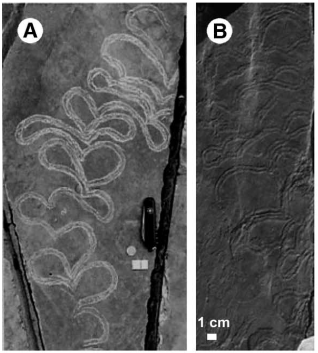
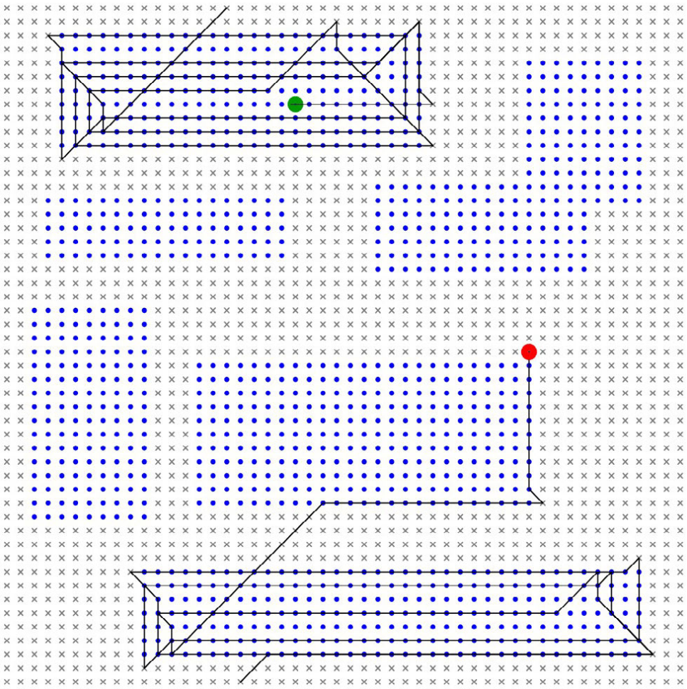

# My journey from ALife to AI

A little trip down memory lane. 

My journey in computing started with a regular computer and ended up in a regular computer with sunglasses.

Artificial life was my doorway to those sunglasses.

<!-- more -->

## Computer science engineering at Michigan State

I started college life thinking I wanted to go into game development. This was quickly rectified after I went to a game jam. Art was the biggest blocker to me. I wanted to focus on something that seemed a little more tractable.

So I stuck with regular ole computer science.

Fast forward to junior year. I had done all the CS classes one would expect and had built up a few programming languages. Now came more theory.

I was taking an advanced data structures and algorithms elective when I came across an interesting professor named Ofria.

Somehow I got wind of his work on a platform called [Avida](https://en.wikipedia.org/wiki/Avida_(software)) and the challenges that went into it. So, I investigated more.

At this point, I had not yet taken a machine learning or artificial intelligence class and didn't know much about these areas. 

## Artificial life 

If you've never heard of artificial life[^clarify-alife-branch] (or alife), I definitely recommend looking it up. The field is broad and it mostly focuses on studying life as a complex system. 

The branch I had stumbled across worked at the [BEACON Center for the Study of Evolution in Action](https://beacon-center.org/)[^beacon-link]. They were a wonderful group of researchers who represented all the areas of alife. They did all sorts of things all focused on studying evolution.

One great example is [Lenski's](https://en.wikipedia.org/wiki/Richard_Lenski) _E. coli_ long-term evolution experiment (LTEE)[^ltee]. One of the cool things there was _E. coli_ evolving to be able to survive in citrate. Which I always took as "an _E. coli_ can survive some household cleaners." But, I could be far off.

This has been a digression. 

I eventually found myself in the very lucky position to be able to do research with the lab. Specifically on a project focused on studying the "origins of intelligence" around the Cambrian Explosion.

Basically, the goal was to study the evolutionary transitions that happened to produce the first life forms that seemed "intelligent". Intelligent in this case meaning sucking up ocean floor nutrients better than their competitors. We have evidence of this smart scum slurping through trace fossils.

<figure markdown="span">
  
  
<figcaption>Examples of trace fossil</figcaption>
</figure>

In Avida, "organisms" are little mini computers. Their "genome" is the code that is executed in their little computer.

This code is made up of an instruction set that look a lot like simple assembly code[^more-on-avida]. Through these instructions the organisms accomplish some task that they can be judged on for "fitness". The most "fit" organisms can then go and reproduce with other organisms. In short, somehow two organisms genomes are mixed together to create a new one.

To do this origins of intelligence work, we fired up a custom version of Avida where our "organisms":

- Exist in a 2d toroidal grid
- Sense if they were standing on food or not
- Turn right or left 45 degrees
- Move forward

In addition to their usual instructions.

What we got out were "trace fossils" of our own that looked like this:

<figure markdown="span">
  
  
<figcaption>Example of an Avida trace</figcaption>
</figure>

Where the:

- Blue dots are "food"
- Little "x" marks are not food
- Green and red circles signify the organism "start" and "end"

The most interesting piece here is _no in-lifetime learning_. Meaning the organisms only "learned" through the system dynamics of Avida. Their genomes evolved these efficient strategies through natural selection[^origins-of-intelligence]. 

I highly recommend reading more about Avida. It's been used to study lots of evolutionary topics. This blog post definitely glosses over the complexities. 

Avida's main role in this article was introducing me to genetic programming and, more broadly, evolutionary computation.

## Evolutionary computation

Working with Avida got me more interested in the class of algorithms associated with it. Evolutionary computation is usually characterized by population based search algorithms. My thought was something along the lines of: "if they can be used to do this very strange alife thing, what else could they do?"

So I took a course on evolutionary computation and learned all about optimization and search. We covered all sorts of algorithms like:

- Genetic programming
- Genetic algorithms
- Particle swarm
- Ant colony optimization

to name a few. It also introduced me to the professor that eventually became my master's advisor. 

At the same time, in my math courses I had taken linear algebra and combinatorics. Setting me up perfectly for my introduction to machine learning tasks.

What had started out as little organisms running around in a silicon petri dish were now algorithms used for difficult problems in industry. 

One of those problems was genome wide association studies, which is what I wrote my master's thesis on using an algorithm called differential evolution[^masters-thesis].

Concurrent to this, I also got to work on multi-objective optimization for neural architecture search. See [here](https://arxiv.org/pdf/1810.03522) for more on that.

This has become me listing my citations. None of this work was particularly influential, so it's not a brag. Just a quick trip down memory lane.

Miraculously, one of my early projects at work also involved me working with a genetic algorithm. We used one to optimize the operations of a mining plant. 

## Conclusion

This is all to say that a strange little field of study got me started down a really exciting path. I am very grateful for that.

This is all definitely a point for multidisciplinary research. Michigan State was an excellent place for that as I got exposed to evolutionary biology, animal science, ecology, and (of course) computer science.

In the near future, I will finish my initial pass at learning Zig. As promised in my [learning blog](./0007_learning_zig_1.md) and [projects for 2026 blog](./0006_projects_for_2026.md), I'll be doing some side projects related to evolution.

Reminiscing on Avida got me excited to recreate a special program called [Tierra](https://en.wikipedia.org/wiki/Tierra_(computer_simulation)) in Zig. More on that soon I hope.

[^clarify-alife-branch]: See [here](https://en.wikipedia.org/wiki/Artificial_life). I'm specifically talking about the "soft" kind of alife that happens in software. Also referred to as _in silico_.

[^beacon-link]: At the time of writing, their website was broken. See also their [wikipedia page](https://en.wikipedia.org/wiki/BEACON_Center). I assume they're still in business. But, given the shake ups in the NSF recently, maybe not :(

[^ltee]: Learn more [here](https://the-ltee.org/) or at the [LTEE wikipedia page](https://en.wikipedia.org/wiki/E._coli_long-term_evolution_experiment). I learned from [Lenski's blog](https://telliamedrevisited.wordpress.com/2025/02/21/some-experiments-work-and-some-dont/) that the LTEE has actually moved from MSU to UT Austin! Given the scale of the experiment, I would love to learn more about how they did it.

[^more-on-avida]: For more on the Avida virtual machine, see their short explainer [here](https://avida-ed.msu.edu/app/cpu_tour.html). 

[^origins-of-intelligence]: The most that came out of this work was a [small conference paper](https://direct.mit.edu/isal/proceedings/ecal2017/29/358/99530) that was published much later. I'm not so sure about the scientific significance. But, personally it was fantastic.

[^masters-thesis]: I didn't put the effort into finding a link to the thesis itself. But a condensed version can be found in [this](https://link.springer.com/chapter/10.1007/978-3-030-39831-6_31) book chapter.