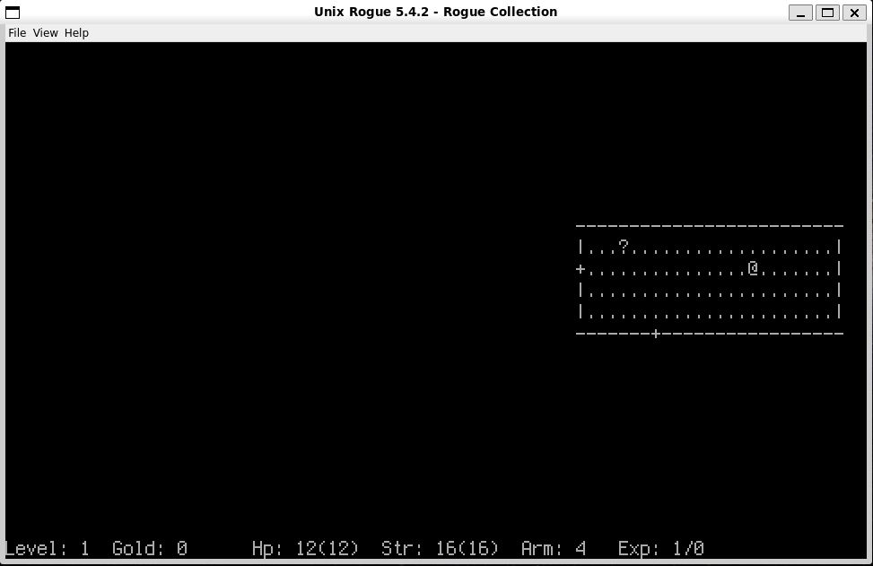

# Playing Rogue with LLMs

Ever wonder if LLMs can play [Rogue](https://en.wikipedia.org/wiki/Rogue_(video_game))? I sure did!

It seems like a match made in heaven. Fully text based game meets text enjoying model. In this post, I detail a little bit about putting together a little package to make this possible.

Don't get your hope up though. I don't do any long running benchmarks.

Check out the code for this post [here](https://github.com/iwhalen/rogomatic-llm).

<!-- more -->

## Inspiration

Recently, Mandalore came out with [his review](https://youtu.be/JkyIlKnMErM?si=lK9K_nLu6QtQajIS) of Rogue. I had generally known about the game due to enjoying a few roguelikes. Of course, modern titles are nothing like the OG.

As you may know, the original Rogue was entirely text based. Here's an example of some high octane gameplay:

```  
╭───────────────────────────────────── Rogue ──────────────────────────────────────╮
│                                                                                  │
│    ------                    ------                     ---------------          │
│    |....|                    |....|                     |.............|          │
│    |....+####################+....|                     |.............|          │
│    ---+--                    |....+#####################+.............|          │
│       #                      ---+--                     |.............|          │
│       #                                                 -------------+-          │
│       ########                              ##              ##########           │
│  ------------+-----------                   -+---    -------+------              │
│  |......................|                   |...|    |............|              │
│  |......................|                   |...|    |............|              │
│  |......................|                   |...|    |............|              │
│  |.............@........|                   |...| ###+............|              │
│  |......................|                   |...+##  |............|              │
│  --------------------+---                   -+---    -+------------              │
│                                              #                                   │
│                                 ##############                                   │
│                            -----+------------------                              │
│                            |......................|                              │
│                            |......................|                              │
│                            |......................|                              │
│                            |......................|                              │
│                            ------------------------                              │
│ Level: 1  Gold: 14     Hp: 12(12)  Str: 16(16)  Arm: 4   Exp: 1/3                │
╰──────────────────────────────────────────────────────────────────────────────────╯
```

Truly a relic of another time. Move with the arrow keys, memorize an esoteric set of hotkeys, imagine yourself happy.

Jokes aside, this game was/is fun and spawned one of the most popular genres of today[^roguelike-gambling].

So, freshly pointed to the excellent [Rogue Collection](https://github.com/mikeyk730/Rogue-Collection) repo, I set out to try to get LLMs to talk to this relic of the past.

## Getting Rogue Collection running

To my immediate dismay, the Rogue Collection does not exactly run out of the box on Linux. At the time of writing, the repo's [README](https://github.com/mikeyk730/Rogue-Collection/blob/bdfffa358752b5f84e5954696346a2fc853c3691/readme.md?plain=1#L67) says it builds and runs on Linux. 

I found this to not be the case on WSL2 Ubuntu 24.04[^reflect-on-wsl2]. I didn't save any build errors, though, so you'll have to trust me.

From [this issue](https://github.com/mikeyk730/Rogue-Collection/issues/74) it seems possible. However, it's been over 10 years since I've touched C or C++. So, I had to fire up our best friend Opus 4.6 in Cursor[^claude-code-note]. 

After 20 minutes or so of guiding updates to type definitions and make commands, things were working! A total Opus 4.6 victory.



If you'd like to try things out as well, check out [my fork](https://github.com/iwhalen/Rogue-Collection).

Again, I only tested this on WSL2 Ubuntu 24.04. So, your mileage will vary.

!!! example "A moment of reflection"

    One year ago, the journey likely would have ended here. 
    
    I can't really say with 100% certainty the changes that were necessary to get Rogue running.

    Other than changing flags on g++ and updating a few variable types, I don't really know what happened.

    A wild world we live in these days.

The first step was done! Now I had to figure out how to get Python to talk to Rogue.

## Rog-O-Matic

Before jumping to Python, I took a closer look at [Rog-O-Matic](https://www.cs.princeton.edu/~appel/papers/rogomatic.html)[^just-look-at-that-site]. I can't say enough about this system. This is _classic_ AI. An [expert system](https://en.wikipedia.org/wiki/Expert_system). Just subsystems and if statements baby.

I feel like every undergrad should have to write a system like this in an intro to AI course. This is how it all used to happen. Before we started shoving data into the deep learning torture nexus and dumping out models. I digress.

From [this piece of code](https://github.com/mikeyk730/Rogue-Collection/blob/bdfffa358752b5f84e5954696346a2fc853c3691/src/Shared/Frontend/start_process.cpp#L112-L138) it seemed clear that there was a way to set up a pipe to the Rogue executable. This way, we can get any ole program to input commands and get outputs.

I thought this would be much easier than it was. Eventually, `pipe-io` mode in Rogue Collection's frontend was implemented by my coding assistant. This uses a similar approach to Rog-O-Matic, but it accepts a pipe identifier from the command line instead of setting it up in C++.

Now we had everything we needed to get Python code talking to Rogue.

## From Python to Rogue

This order of events isn't exactly coherent. I implemented "human mode" first in the Python package to try to send terminal inputs to Rogue through Python. So the [`HumanPlayer` class](https://github.com/iwhalen/rogomatic-llm/blob/19b8e9c346600c6cdca14ddd9c4ab8ae2522b43e/src/rogomatic_llm/player/human.py#L67) was implemented in tandem with the `pipe-io` mode in the Rogue Collection.

This all uses a [`RogueGame` class](https://github.com/iwhalen/rogomatic-llm/blob/19b8e9c346600c6cdca14ddd9c4ab8ae2522b43e/src/rogomatic_llm/external/game.py#L59) that does the actual handling of piping to and from Rogue.

I also used `typer` for a simple CLI that starts games with the given model string in the driver's seat. I only tested Anthropic models for this work. But, it would likely work with others.

Investigate the [repo](https://github.com/iwhalen/rogomatic-llm) more if you're interested. It's shamefully 95% vibe coded, but it does work!

## Defining the agent

This is less of an agent and more of an LLM being called in a loop. But, I guess that is what an agent is.

The input and conversation history is the entire board state as text. So the LLM sees (basically) what we see in the image of Rogue above. There is a configurable memory limit on the history of messages that are kept.

The structured output of the LLM is this model[^reasoning-field-paper]:

``` python 
class RogueAction(BaseModel):
    """Structured output from the LLM."""

    reasoning: str = Field(
        description="Brief analysis of the current situation and chosen action"
    )
    keys: list[str] = Field(
        description=(
            "List of actions to execute in order. Each element is one"
            " logical action (e.g. 'h', 'fj', 'ea'). Return 3-8 actions"
            " when the path is clear."
        ),
    )
```

So, at each step we have the model output a list of "keystrokes" to send to Rogue. I did not tinker with the suggested limit of actions. However, with a smarter model like Opus 4.6 driving, it often generates long action sequences.

I tried out `pydantic-ai` for this project. Given this agent was dead simple, so was the code that implemented it. I don't have much to say about `pydantic-ai` other than that it did its job.

## Results

I don't have much to say here! It works, that's about it. The interface works. Any LLM that supports structured outputs and is in `pydantic-ai` should work with this.

The [repo](https://github.com/iwhalen/rogomatic-llm) has a gif of the first few seconds of a run:


Some general observations about Sonnet:
- Generally it understands what happening and can move through spaces.
- It can mix "move left" and "move all the way left until I hit something" commands intelligently.
- I never saw it move down a floor. 

You're more than welcome to fork the code and burn through some credits. I didn't want to spend much money on any _real_ benchmarking at the moment[^note-on-time].

Costs start to rack up quite quickly with this approach. There's likely some optimizations to be made.

I also ran into a `ModelHTTPError` after a particularly long run. Let that be a warning that this codebase is not bug free!

## Extensions

This is very preliminary work I did by burning through a month of Cursor credits in a weekend. Here, I'll discuss a few extensions that would be necessary to make this "real".

### Seeding

Currently, there's no interface to seed the Rogue runs. For experimental consistency, this would be necessary. I'm sure this is possible though as the Rogue Collection has the ability to replay certain saves.

### Action queue changes

I'm not convinced the "list of actions" approach is the right way to do this. Imagine if an LLM outputs a list of 8 "go left" commands. If, suddenly, a monster appears on the third "go left", you would likely want to do something else.

It's not clear to me what that "something else" is though. One option would be stopping execution of a list if something new appears on the screen.

More specifically, at generation we know the items, monsters, doors, etc. that are on the screen. If, at some point during execution a new, previously unseen element appears, we would want to stop executing and generate a new action list.

### Toward a benchmark

This would be really cool as an agent benchmark. Score on Rogue is a clear value to compare models.

Of course, one would have to compare to Rog-O-Matic. This could be the baseline even. The Rog-O-Matic [website](https://www.cs.princeton.edu/~appel/papers/rogomatic.html) also shows some values for human experts. Based on the median score, Rog-O-Matic performs better than any human. So, it's an aspirational baseline.

Games [seem to be getting more popular](https://blog.google/innovation-and-ai/products/kaggle-game-arena/) in the LLM benchmarking space. I hope this one can someday be a part of the conversation!

### Gymnasium environment

Looking back, I wish I made the Rogue interface a [gymnasium](https://github.com/Farama-Foundation/Gymnasium/) environment.

This would make things maximally useful for other algorithms. However, I'm not sure what the reward signal would look like as "score" doesn't seem immediately available. 

### Scratchpad

Finally, I think a "scratchpad" or "journal" approach would work really well here. Having the model keep track of major experiences it has had in a markdown file would likely work quite well.

The memory buffer of the last N frames will quickly lose information on a long running game.

Thanks for reading. Bye bye!

``` bash 
╭───────────────────────────────────── Rogue ──────────────────────────────────────╮
│                                                                                  │
│                                                                                  │
│                                                                                  │
│                                                                                  │
│                                                                                  │
│                                                                                  │
│                                                                                  │
│                                                                                  │
│                        __________                                                │
│                       /          \                                               │
│                      /    REST    \                                              │
│                     /      IN      \                                             │
│                    /     PEACE      \                                            │
│                   /                  \                                           │
│                   |    rogomatic     |                                           │
│                   |      41 Au       |                                           │
│                   |   killed by a    |                                           │
│                   |    hobgoblin     |                                           │
│                   |       2026       |                                           │
│                  *|     *  *  *      | *                                         │
│          ________)/\\_//(\/(/\)/\//\/|_)_______                                  │
│                                                                                  │
│                                                                                  │
│ [Press return to continue]                                                       │
╰──────────────────────────────────────────────────────────────────────────────────╯
```

[^roguelike-gambling]: I actually have a lot to say about roguelikes. Of course I enjoy playing them. But, I can't think about them for too long before I start to think too much about gambling. As you may know, [everything is gambling](https://www.youtube.com/watch?v=9Ii1ROzeSwU) these days. And the randomness of roguelikes feel a little close to scratching the gambling itch sometimes. This is another post though.

[^reflect-on-wsl2]: Certainly WSL2 is not the issue. The authors writing something specific for WSL would be kind of dumb given their whole repo is set up for Windows. But, there is definitely some value in a well-documented Linux setup.

[^claude-code-note]: I have since moved back to Claude Code. I can't decide which I like more. Cursor feels "batteries included". But, Claude Code has the juice.

[^just-look-at-that-site]: Just look at that site! _Last updated 4-Mar-94 by fuzzy@cmu.edu_. They really don't make them like this anymore.

[^reasoning-field-paper]: This [paper](https://arxiv.org/pdf/2408.02442v1) has me stuck on the ordered "reasoning, outcome" format for structured outputs. The ordering and reasoning field makes sense. But, given the fact that all useful models are reasoning models these days, I'm not sure it's necessary anymore. This could be an interesting follow up to that paper.

[^note-on-time]: Note that if you do want to do some longer and repeated runs, I would suggest reducing the `action_delay` to (almost) nothing. It might also make sense to have a "silent" mode that only saves logs for replay later and the final score. 