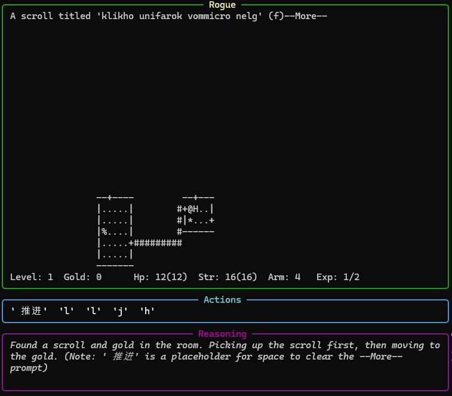
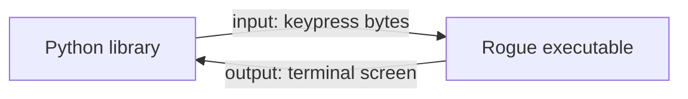
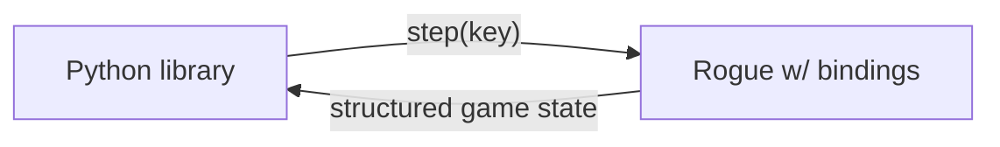

# Rogue-Bench

After a couple months of work, she's finally done. Rogue-Bench is my contribution to the already overflowing list of LLM benchmarks.

This is an extension of my previous work [here](https://github.com/iwhalen/rogomatic-llm). So check that out first for some context.

<!-- more -->

## Introduction

If you're coming here from the [docs](https://iwhalen.github.io/rogue-bench/), welcome! This is my personal blog. Specifically, the post where I explain a little bit more about Rogue-Bench development.

As I said in a [previous post](0010_rogomatic_llm.md), this all started from watching a review of [Rogue](https://en.wikipedia.org/wiki/Rogue_(video_game)) on Youtube. I had always been vaguely aware of Rogue due to discussion around Roguelike or Roguelite games. That, and a few recent LLM-focused game playing benchmarks[^game-playing-examples] got me interested in implementing Rogue as a benchmark. Specifically, using entirely text inputs.

## Development

The big changes from the original project mostly came on the Python side. For example,

- Implementing run saving / seeding and replays from the Python API
- Making it easy to configure and add new agents to play Rogue
- Adding Docker functionality (which may or may not 100% work)
- Lots of tweaks to logging and statistics being output, including logging Rog\-O\-Matic statistics

Some additional changes to the Rogue executable were needed for Rog-O-Matic as well[^idk-what-though].

Overall, this process was fun! It really gave me something to look forward to. I wish it took a little less time though. Life and work got in the way a few times. Hopefully my next project is a little more bite sized.

I'd be happy to work on it more if this gets some attention.

## Results

### Overview

All the resulting runs I show on the [leaderboard page](https://iwhalen.github.io/rogue-bench/leaderboard/) are displayed [here](https://github.com/iwhalen/rogue-bench/tree/main/results/). There, the "score" is basically how much gold an agent picks up.

Generally speaking, none of the LLMs really impressed. You can run the replays yourself to see. This may be because of my focus on low cost models. 

I find the main failure modes are:

- Not being able to move in the correct direction. A model will say it wants to move "down" but press the key for anything but down.
- Getting lost in dark rooms. The second floor of seed 0 has a "dark" room and models completely break down inside of it.
- Models often get very stuck in a singular goal. That goal, combined with moving into a wall for 50+ turns means the run ends due to being stuck.

These are the big ones. There's definitely more that would require a more thorough analysis of the replays.

### Gemini 3 quirks

One of the more interesting things I ran into was Gemini 3 Flash outputting Chinese characters.


 
The reasoning says that the characters (which Google translate tells me mean "advance" in English) are a "placeholder". Maybe they were output given the garbled, unidentified item name? Who knows. The fix for this was to replace any characters that couldn't be encoded properly with a single space.

### Experimental setup

In retrospect, setting a hard 10 minute time limit was not the _best_ idea. However, it _was_ easy. A more controlled experiment would limit by number of turns rather than time spent.

You could make an argument the other way as well. A very smart model might spend a lot of time thinking on its fixed set of turns. Meanwhile, a less intelligent model may respond quickly. In this case, the fixed number of turns don't have the same effort involved. 

Another obvious issue is the fixed seed. We only get an idea of models' performance on seed 0. Ideally, we'd want to check 5 to 10 runs across 5 to 10 different seeds.

Of course, all agents get the same [system prompt](https://github.com/iwhalen/rogue-bench/blob/29bc97870a2ebaab33c98aac090d2b8423399928/src/rogue_bench/agent/naive.py#L38) and a low temperature. More specifics on config can be found in the [github repo](https://github.com/iwhalen/rogue-bench/tree/main/config).

## Known issues

There's probably other issues, but this is what I know is a problem at the moment.

### Score

Getting the score implemented properly to have a fair comparison across runs was a bit tougher than expected.

In the original [Rog-O-Matic](https://www.cs.princeton.edu/~appel/papers/rogomatic.html) page, all it says for score is "The player's score is the amount of gold he obtains, with bonuses given for retrieving the amulet." Diving into [the code](https://github.com/mikeyk730/Rogue-Collection/blob/main/src/RogueVersions/Rogue_5_3/rip.c), there's lots of special logic for winning or losing. 

I had to make the choice to properly kill a run if the death screen appears. LLMs usually got confused when this happened. So, I only use the amount of gold. The default Rogue behavior for a loss is to remove 10% of the goal earned before calculating score. So, we do that too. 

This isn't really an issue since no LLM players that I tested have even gotten past the second floor. Nowhere near winning. If, by some miracle, an LLM does beat the game we can use the replay to calculate the score properly.

### Parallelism

It seems obvious that one would want to execute many LLMs in parallel to benchmark.

However, with the current implementation, it doesn't seem that this is possible. I assume this is due to how the pipes handle input from the Python code to the Rogue code. But I didn't dig too far in. The `scripts/run-serial.py` script handles looping so at least one doesn't need to sit idly and watch every run finish.

### `NaiveAgent` 

As its name may suggest, the `NaiveAgent` implementation leaves much to be desired.

It simply uses a fixed history of 25 turns and a static, unoptimized system prompt. There's a lot one could do here and I hope a brave reader out there with lots of money to spend on tokens figures out something smarter.

See the wish list below for more ideas.

### Random crashes

I'll often find that a run "completes" but seems to end for no reason. These seem impossible to diagnose, but they're worth pointing out. 

If you see a run with a "completed" status that only has a few moves and the final screen is not the death tombstone, this is why. 

### Tokens

Obviously, Rogue-Bench wasn't evaluated on all of the state of the art models in some intelligent, exhaustive scheme. That's because I don't want to spend very much money on it[^brokie]. That's all.

If you're a high roller and want to donate me an API key (or just create results yourself) let me know.

I wanted to get some OpenRouter models on the list but found most providers were too high latency. Maybe I'll come back to this.

## Wish list

### Python bindings

Currently, Rogue-Bench works with pipes. Inputs and outputs are piped back and forth from the headless Rogue executable to the Rogue-Bench Python library. The binary is still in charge of advancing the game and keeping track of state.

The current state looks like:



It would be a fun project to move more control to the Python library. One way to do this is with Python bindings. So, replace the current C interface with one that is called from Python. Most of the logic gets to stay in the 40+ year old C libraries, but overall control is left in Python.

This hypothetical end state would be:



This was a bit too big of a lift for me on this first pass though. It would be a great learning experience though.

### Precompiled binaries

A quality of life change would be shipping the precompiled Rogue binary with Rogue-Bench. This would remove the need to compile and simplify the user experience a bit.

However, I'm not sure on the licensing issues here. The open source Rogue Collection already feels like a gray area. 

### Agent harnesses

The major juice to squeeze on Rogue-Bench is likely in the agent harness. Right now the `NaiveAgent` is about as simple as one could imagine. Here are some thoughts on how this could be improved.

First, one could try rendering an image of the terminal and using that as input instead of the raw text. It kind of defeats the purpose of "text only", but may better measure LLMs' reasoning capabilities.

Next, we could reduce the overall history and introduce a "note taking" tool. This would let the agent write out what has happened so far and overall goals. This could help with planning.

Another idea I considered was including "early stopping" in the move list. Imagine an agent outputs a big list of moves like `['h', 'h', 'h', 'k', 'k', 'k', 'k', 'l']`. If, at some point, a monster appears in that list of commands, the agent wouldn't find out until all the moves complete. At that point, it may even be dead! Introducing a mechanism that stops a move list and informs the model that the stoppage was because a monster appeared could be helpful.

I could skip designing the harness entirely and try to hook up Codex or Claude Code to Rogue-Bench. This would get around the API-based pricing that limited this work a bit. 

### Reinforcement learning

Finally, the holy grail (for me) on this work would be to try to carry out reinforcement learning with Rogue as the environment.

In my head, the general plan would look like:

- Implement Rogue-Bench as a [`verifiers`](https://github.com/PrimeIntellect-ai/verifiers) environment.
- Generate rollout data with Rog-O-Matic across many different seed environments.
- Tune a small language model using the Rog-O-Matic rollouts.

There's an immediate problem with this plan. Namely, Rog-O-Matic only makes one move at a time. This isn't the most token-efficient way to move, but maybe some data manipulation could be done to combine the Rog-O-Matic moves into a list of moves.

Either way, the dream would be to get a model that performs better than Rog-O-Matic eventually.

## Conclusion

This is by far the most time I have contributed to a project outside of work or school. It was a slog at times and I was quite hesitant to spend any extra money on tokens for it. 

It seems clear that LLMs cannot play Rogue. That was my assumption from the start, but I think it was still a good exercise to put together a benchmark.

That's all! Thanks for reading.

```
                       __________
                      /          \
                     /    REST    \
                    /      IN      \
                   /     PEACE      \
                  /                  \
                  |    blog post     |
                  |       0 Au       |
                  |   killed by a    |
                  |    hobgoblin     |
                  |       2026       |
                 *|     *  *  *      | *
         ________)/\\_//(\/(/\)/\//\/|_)_______
```


[^game-playing-examples]: For example, [ARC-AGI-3](https://arcprize.org/arc-agi/3) and [Game Arena](https://www.kaggle.com/game-arena).

[^idk-what-though]: What changes exactly? That's between GPT-5.5, Codex, and the good Lord. My knowledge of Rogue-Bench is mostly contained to the Python codebase. I wouldn't have been able to properly guide a coding agent in the Rogue codebase anyway (C code older than I am). So, I just had to accept whatever it was doing and move on. Shameful, I know.

[^brokie]: Brokie behavior, I know. But I just couldn't justify spending much more than $30 on a small side project. Especially when I was pretty certain that none of the flagship models would do very well either.
