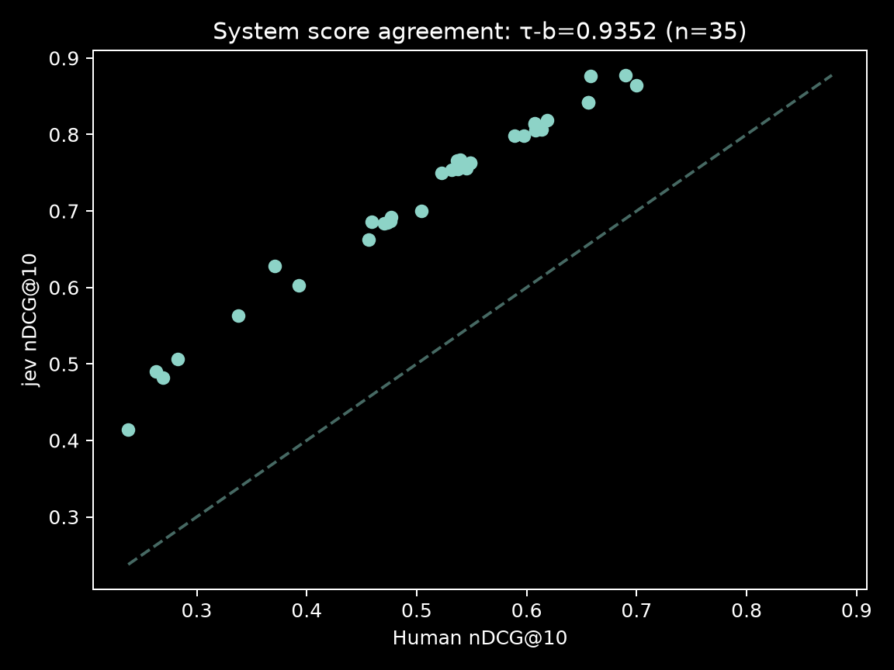
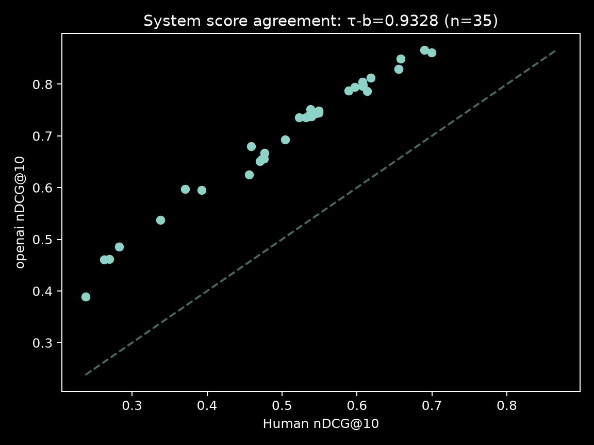

# Pseudo-relevances with Jev

The world is abuzz with excitement at the new "system one" models being pumped out right now. In this post, I take a look at how good these models are at generating relevancy scores on the TREC `{0, 1, 2, 3}` scale.

The code used to create the results in this blog can be found [here](https://github.com/iwhalen/jev-pseudo-relevance).

<!-- more -->

## Jev hype

If you're reading this, you likely already know about [Jev](https://typesafe.ai/blog/introducing-system-one-models-and-jev). My initial reaction upon seeing Jev was informed by ML-twitter pundits. Namely, one of skepticism. 

Originally, I think my noise alarm was going off due to the lack of novelty. The TypeSafe folks seemed to be selling a classifier wrapped in a hype blanket. Given their founders' clout, it worked. They even got a couple dollars from me for this blog post.

As the dust settled a little bit, it seemed the approach wasn't that novel. Given how many open source clones jumped up within days of Jev getting popular, this was something one could easily whip up on their own. 

However, I did appreciate the focus on the use cases and problems Jev-likes solve. I've always felt that a lot of agent systems are glorified classifiers absolutely eating tokens on tasks one would have accomplished with a BERT-like in 2022.

Some focus from the search community[^search-community] made me interested in using Jev as a relevancy judge. So, I whipped up a script with the help of my favorite coding assistant to test this out.

For comparison's sake, I also used GPT-6-luna.

## Experiment setup

What I landed on is likely a common setup for the retrieval community. However, my procedure was inspired by [this paper](https://arxiv.org/pdf/2405.07767).

In both cases, I used the same prompts for both Luna and Jev[^prompting-jev].

### Data blues

My initial goal was to create a dataset that used the [TREC DL 2023](https://microsoft.github.io/msmarco/TREC-Deep-Learning.html) data to judge how good Jev is at assessing the relevance of a given passage.

To take a step back, let's go over what exactly is going on here. TREC datasets are in the following format:

- A corpus: a collection of documents, in our case MS MARCO v2.
- Queries: the set of information needs to be fulfilled by the query through search.
- Query relevance judgments: also called qrels, these are a mapping between a query and a document

In TREC's case, qrels also come with a grade. These grades are 0-3 integers that specify:

- 0 (Irrelevant): The passage has nothing to do with the query.
- 1 (Related): The passage seems related to the query but does not answer it.
- 2 (Highly relevant): The passage has some answer for the query, but the answer may be a bit unclear, or hidden amongst extraneous information.
- 3 (Perfectly relevant): The passage is dedicated to the query and contains the exact answer.

These grades are created by human labellers comparing a query and a passage. Our goal is to see how well a model can do this automatically.

You can read more about TREC DL 2023 in their [overview paper](https://arxiv.org/pdf/2507.08890). 

To accomplish this task all we need from the TREC DL 2023 track is the judged queries, qrels, and (importantly) only the corpus entries that were actually used in the judgments[^trec-note]. If we didn't get rid of the non-judged corpus entries, this dataset would be over 20 GB!

However, it seems this exact collection does not exist. It exists for TREC DL 2022 and 2021! But not 2023. So, I had to do it myself.

This resulted in my first Hugging Face dataset upload: https://huggingface.co/datasets/iwhalen/trec-dl-2023-judged. I was a little spooked doing this as I thought I would get it wrong. But, as it turns out, it matches the summary stats from the TREC DL 2023 overview paper. 

### Measurements

The first thing we'll want to measure is "rater agreement" with [Cohen's kappa](https://en.wikipedia.org/wiki/Cohen%27s_kappa). We have our list of human annotations and our list of automatic annotations. We want to measure how often humans and our judges agree. This statistic gives us that.

Second, we'll make use of the TREC DL 2023 runs. This is a bunch of different retrieval systems run on the dataset that we can use to calculate retrieval metrics. For example, nDCG@10. Then, we can calculate those same systems' metrics using our pseudo-relevance scores. This will give us two ranked lists of systems that we can compare with [Kendall's tau](https://en.wikipedia.org/wiki/Kendall_rank_correlation_coefficient)[^self-promo].

## Results

Note that in all cases we used `jev-latest` and `gpt-6-luna` with `none` for reasoning effort.

### Rater agreement

#### Jev 

| Human grade | Jev 0 | Jev 1 | Jev 2 | Jev 3 | Total |
|---|---:|---:|---:|---:|---:|
| 0 | 5,337 | 6,086 | 1,859 | 584 | 13,866 |
| 1 | 403 | 2,050 | 1,413 | 506 | 4,372 |
| 2 | 67 | 654 | 941 | 597 | 2,259 |
| 3 | 13 | 303 | 650 | 864 | 1,830 |
| **Total** | **5,820** | **9,093** | **4,863** | **2,551** | **22,327** |

**Cohen's kappa**: 0.1907

#### GPT-6-luna

| Human grade | Luna 0 | Luna 1 | Luna 2 | Luna 3 | Total |
|---|---:|---:|---:|---:|---:|
| 0 | 7,790 | 4,281 | 1,423 | 372 | 13,866 |
| 1 | 984 | 1,617 | 1,299 | 472 | 4,372 |
| 2 | 215 | 549 | 957 | 538 | 2,259 |
| 3 | 54 | 303 | 748 | 725 | 1,830 |
| **Total** | **9,043** | **6,750** | **4,427** | **2,107** | **22,327** |

**Cohen's kappa**: 0.2391

#### Discussion

Obviously, Luna does a tad better than Jev on this task. But neither are good overall measures if rater agreement is all we cared about.

There's some more nuance if we look at the specific grades. For example, Jev is a bit better at predicting 1's and 3's while Luna is better at 0's. 

### System ranking agreement

#### Jev

#### GPT-6-luna

#### Discussion

This tells a different story. Jev and Luna are essentially tied here.

If we want to compare to some academic results, [this paper](https://arxiv.org/pdf/2502.13908) shows similar ranges for kappa and tau across a couple dozen methods. Both methods fall below the results found in that work, so there's room to grow here. Either way, the academic results' conclusion agrees with what we find here: rater agreement can stink while still having a good system ranking.

Certainly, some prompt tuning is in order for both cases.

### Time is money

Finally, we would of course love to see how long things took.

| Method | Total cost (USD) | Average time per request |
|---|---:|---:|
| Luna | $1.3283 | 3\.442 s |
| Jev | $0.6783 | 0\.145 s |

Note that total request time is not wall time as these queries were run in parallel. For Luna, I did not take into account any potential caching, just raw input and output tokens. From my API platform dashboard, it seems like there were almost no cache hits. So, this is a fine estimate.

This is certainly where Jev shines. The Luna results took about an hour, while the Jev results took around 5 minutes. A night and day difference. I can only imagine Jev-likes will become more popular in the information retrieval space due to this. 

## Conclusion

Overall, if you just care about ranking systems, Jev is the clear winner.

This was a fun little experiment. I hope you enjoyed it as well. Information retrieval has grown near and dear to my heart over the past year. I'll probably write more about this in the future, but it feels like the least of all evils in the current AI hype cycle.

I would have loved to try a local, open source version of Jev. But I could not be bothered to torture my poor RTX 3070.

Thanks for reading! Hopefully I will have more updates on my main project, [Zierra](0014_zierra_1.md), soon!

[^search-community]: For example, Doug Turnbull's blog on using Jev for query understanding: https://softwaredoug.com/blog/2026/09/22/jev-query-understanding

[^prompting-jev]: I have no idea what the heuristics are for prompting these "System one" models. So, buyer beware.

[^trec-note]: There's much more to be said here about how TREC does something called pooling. I'll omit this for brevity though. All that is important is if a document is not in the qrels, it is considered irrelevant. For more on how TREC creates datasets and a history of the topic, see here: https://www.nist.gov/publications/evolution-cranfield 

[^self-promo]: If you're itching to learn more about this statistic and love reading the words I write, see [my blog on Kendall's tau](./0017_kendall_tau.md).