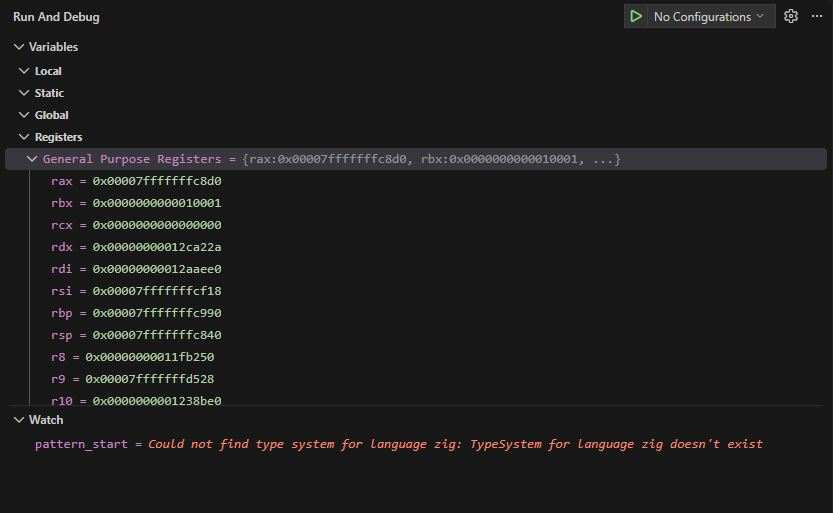

# Zierra part 2

This is another exciting entry in my implementation of Tierra in Zig. 

You can follow along in the repo [here](https://github.com/iwhalen/zierra). 

<!-- more -->

## Slow goings

I assume all my blog posts are being read by only robots. But if you are a human actually following this, you may notice that [part one](./0014_zierra_1.md) of this series was almost exactly 4 months ago. Not exactly steady progress! See the original post if you are unclear on what this is about.

I have done some smaller, mostly vibe coded, projects in between these Zierra updates. Those were more about outcomes of an idea rather than the implementation. So, I don't feel so bad about turning over the keys to the code. They were also in Python, a language I have been writing in for over a decade. So, I feel writing it all out by hand wouldn't teach me as much as the actual outcomes and planning. As opposed to Zierra, where my goal is to actually write the code and get comfortable with Zig.

I digress. This post will focus on how I am developing Zierra, some things I struggled with in Zig, and a surprising piece of Zig that I think is really neat.

## Progress

The two main pieces of work I have implemented since June are the template search module and a functioning virtual CPU.

### Template search

Operations that handle control flow in Tierra (e.g., `jmp`, `ret`) do so with "templates". A template is a pattern of `nop` instructions specifying the "operand" and "match" of a template. Let's look at an example.

```
0   adrf
1   nop_0   // Operand start
2   nop_1    
3   nop_1   // Operand end
4   inc_a
5   nop_1   // Match start
6   nop_0   
7   nop_0   // Match end
8   inc_b   
```

The "operand" after `adrf` is `nop_0 nop_1 nop_1`. We'll come back to what, exactly, `adrf` does. Most importantly, it conducts a "forward search". When we do a forward search we're looking for the complement of the operand somewhere at a higher address. Namely, `nop_1 nop_0 nop_0`. In the search we find it in addresses 5-7. Part of `adrf`'s function is to then store the address 8 in a CPU register. So, overall, `adrf` takes its operand (if it has one) and then tries to find the matching complement somewhere else. If it finds it, it stores the address after it.

The `jmp` instructions use this same template search.

The actual algorithm to accomplish this template search is a leetcode easy level problem. It is basically just string matching with some extra steps.

The more interesting piece of this work is the virtual CPU.

### Central processing

In Tierra, every creature has its own CPU. This CPU is a super simple struct with a bunch of methods to execute instructions. The struct looks like:

```zig
struct {
    // Address registers.
    ax: u16 = 0x000,
    bx: u16 = 0x000,

    // Numerical registers.
    cx: u16 = 0x000,
    dx: u16 = 0x000,

    // Flags
    fl: u8 = 0x00,

    // Stack pointer
    sp: u16 = 0x00,

    stack: [stack_depth]u16 = undefined,

    // Instruction pointer
    ip: u16 = 0x000,
};
```

If you know how regular CPUs work, you'll recognize the basic parts needed to carry out computation.

Those computations are then defined by instructions. Tierra has 32 total instructions that make up organism genomes. The CPU's `execute` method then has a huge switch statement that routes to the appropriate CPU methods:

```zig
switch (instruction) {
    // Plain register operations and no ops
    Instruction.nop_0, Instruction.nop_1 => return self.nop(soup.len),
    Instruction.or1 => return self.or1(soup.len),
    Instruction.shl => return self.shl(soup.len),
    Instruction.zero => return self.zero(soup.len),
    Instruction.sub_ab => return self.sub_ab(soup.len),
    Instruction.sub_ac => return self.sub_ac(soup.len),
    Instruction.inc_a => return self.inc_a(soup.len),
    Instruction.inc_b => return self.inc_b(soup.len),
    Instruction.dec_c => return self.dec_c(soup.len),
    Instruction.inc_c => return self.inc_c(soup.len),
    Instruction.mov_cd => return self.mov_cd(soup.len),
    Instruction.mov_ab => return self.mov_ab(soup.len),
    // Stack operations
    Instruction.push_ax => return self.execute_push(soup.len, self.ax),
    Instruction.push_bx => return self.execute_push(soup.len, self.bx),
    Instruction.push_cx => return self.execute_push(soup.len, self.cx),
    Instruction.push_dx => return self.execute_push(soup.len, self.dx),
    Instruction.pop_ax => return self.execute_pop(soup.len, &self.ax),
    Instruction.pop_bx => return self.execute_pop(soup.len, &self.bx),
    Instruction.pop_cx => return self.execute_pop(soup.len, &self.cx),
    Instruction.pop_dx => return self.execute_pop(soup.len, &self.dx),
    // Conditional skip
    Instruction.if_cz => return self.if_cz(soup),
    // Jumps
    Instruction.jmp => return self.jmp(soup),
    Instruction.jmpb => return self.jmpb(soup),
    Instruction.call => return self.call(soup),
    Instruction.ret => return self.ret(soup.len),
    // Address to register
    Instruction.adr => return self.adr(soup),
    Instruction.adrb => return self.adrb(soup),
    Instruction.adrf => return self.adrf(soup),
    // Copy
    Instruction.mov_iab => return self.mov_iab(soup, creature),
    // Allocation
    Instruction.mal => return self.mal(soup),
    // Divide
    Instruction.divide => return self.divide(soup, creature),
}
```

The biggest piece of this work was implementing all of those instructions and making sure they were close enough to the intended implementation. Obviously this took a while. But, it was fun, incremental work that had a clear finished state.

If you're interested in any specific implementation, see the file [here](https://github.com/iwhalen/zierra/blob/main/src/core/cpu.zig).

## Coding assistant use

Next I wanted to give an update on coding assistant use on this project. 

### A tool for learning

As I said in [part one](./0014_zierra_1.md), the goal of this project is to learn Zig. Having a coding assistant dump out the whole project in one go would, of course, teach me nothing. So, I have only used them in a planning and question answering capacity. If I don't exactly know how something should work, the assistant checks my `reference/` directory for guidance.

That directory contains:

- The entire Zig `0.16.0` standard library.
- The Zig `0.16.0` language reference
- The original Tierra paper (in PDF and Latex).

Then, in response to these questions, the assistant provides pseudocode, explanation, and references to Ziglings where appropriate. My [AGENTS.md](https://github.com/iwhalen/zierra/blob/main/AGENTS.md) is intended to instruct explicitly against writing any code. 

A new addition to this reference material is Tom Ray's original implementation of Tierra[^not-exactly]. Sometimes, the paper is ambiguous on how certain things should work. For example, the many error conditions that could happen in a `jmp` command. For these cases, the codebase is helpful to make things explicit.

Note that this is not turning into a line-by-line rewrite. My coding assistant is only ever using this to clear up ambiguity.

### An exception to the rule

I have decided to make one fairly large exception to the rule of "no agents writing code." That being unit tests. I feel like I would never actually finish this project if I wrote the tests myself. Overall, this feels ok as I'm not sure how much I will learn from writing them myself. 

While prompting for these tests, I tried to be explicit that the tests should be written how the code _should_ work. Rather than just writing a test that will pass based on the current (potentially erroneous) implementation. This caught quite a few bugs in the `execute` implementation in the CPU. 

Up until now, the only tests that have been generated are the tests for all the instructions in the CPU module. I can't think of a more tedious thing than testing all the different CPU states and branches of these instructions. All in all, this ended up being over 600 lines that I'm happy that I didn't have to write myself.

### Tooling choices

Finally, I wanted to give a little recap on which tools I've been using.

For the majority of this phase of work, I had ditched Codex / Claude Code for OpenCode. Their Zen plan was more than enough for my work on this project. Throughout these past months they have had some crazy discounts and free model rotations. For example, GPT-5.6 Sol was 50% off for a few months. So, I was happy to pay API pricing for the small questions I had about implementation details. Other models I tried out were Muse Spark 1.3 (free at the time) and Deepseek v4.1 Flash. I also had a few OpenRouter credits lying around, but I had nothing but issues getting OpenCode to use OpenRouter models.

For October, however, I'm on a four week vacation from work. During this time, I expect to do a bit more vibe code-ish projects. For example, my [post on Jev](./0018_jev_pseudo_relevance.md). There wasn't much to gain from coding all that myself, so it is almost entirely generated. Accordingly, I set up a Codex sub for just one month to support such projects[^codex-bug].

## Debugging

I was disappointed to find the lack of seamless support for a Zig VSCode debugger. Maybe it is because I'm on WSL, but I couldn't get it working. I don't have much to say about this as it was a while ago that I tried and don't completely understand why it wasn't working.

Running a unit test from VSCode works fine thanks to the [`vscode-zig`](https://codeberg.org/ziglang/vscode-zig) extension. However, attempting to debug that same test leaves something that looks like this:



I can step through an execution and see register values. Looking at anything useful with a watch or just viewing local variables is broken though. Tragic.

I read out of date articles, messed with configs, tried to install other extensions all to no avail. I had to settle for old fashioned unit tests and print statements[^debugger-note].

## Pick a type, `anytype`

First, a little background. I'm trying to do my best [TigerStyle](https://github.com/tigerbeetle/tigerbeetle/blob/main/docs/TIGER_STYLE.md) impression in Zierra. Specifically, trying to do everything at compile time with no dynamic allocations. 

There are two main pieces of memory that need to be allocated:

- The soup's two arrays: one of instructions, one of "ownership" of soup addresses.
- The CPU stacks that each creature gets.

In my `config.zon`, we have a soup size and a CPU stack depth. Luckily, Zig is fancy and reading from such files gives us `comptime` values. Meaning, we can do all of this allocation at compile time.

However, it also means that our `Soup` and `CPU` types have to come from type functions. Specifically, they look like this:

```zig
pub fn Soup(comptime size: u16) type {
    // ... comptime checks...

    return struct {
        const Self = @This();

        memory: [size]Instruction;

        // ... fields, methods...
    };
}
```

```zig
pub fn CPU(comptime stack_depth: u16, comptime search_limit: u16) type {
    // ... comptime checks...

    return struct {
        const Self = @This();

        stack: [stack_depth]u16;

        // ... fields, methods...
    };
}
```

For `Soup`, `size` defines how many instructions are in the soup. For `CPU`, `stack_depth` is how many operands can be pushed on the stack, and `search_limit` defines how far we're willing to search for an operand match in instructions like `jmp`.

Then, to construct `Soup`, for example, we do something like:

```zig
var soup = Soup(1234){};
```

The way I understand it, when `Soup(1234)` is compiled, the compiler handles the memory allocation for the arrays inside `Soup`. At runtime, when we initialize with `{}`, we get the instance the compiler created and can modify it as needed. This has been my best impression of someone who uses compiled languages.

What exactly is happening under the hood isn't too important. What is important is how we use these types elsewhere. Or don't use them actually.

If we wanted to define a function that accepts `soup` as we defined it above, the easiest way (I think) is to do this:

```zig
pub fn drink(soup: anytype) void {}
```

This way, at compile time when we write a call like `drink(Soup(1234){})`, the Zig compiler infers that this function should accept a `Soup(1234)` type. However, this means everywhere inside `drink` we have no autocomplete for the `soup` parameter. It is `anytype` which doesn't give us any type information. 

Everything still works at the end of the day. It just feels a little off. I'm uncomfortable with `anytype` I guess. I'm sure I would be even more uncomfortable if we were using C macros or `void *`. 

An example of this in the standard lib is the `hash_map` module [here](https://codeberg.org/ziglang/zig/src/commit/06efbc37cb777907178217e8f994737736b27b74/lib/std/hash_map.zig). The `HashMap` type function returns a `struct` with the type information of the keys and values.

## Union confusion

The next piece that took me a long time to get my head around is type unions. In Zierra, each implementation of a CPU instruction returns an `ExecResult`. This is defined as:

```zig
pub const ExecResult = union(enum) {
    // No extra work is needed from the simulation.
    none,
    // Memory allocation request for new creature.
    divide: Allocation,
    // Creature request for memory.
    mal_request: u16,
    // Instruction generated an error flag.
    error_condition,
    // Creature successfully executed a hard instruction (adr/mal).
    hard_instruction_success,
};
```

Initially, I tried to define this as a `struct`. Each field was optional and only one was "set" on return. This was super messy and had me asking for a different route. 

Moving forward, `union` is the obvious winner. It just took some work getting used to. For example, the `none` field. This is a "void" type. Meaning, it has no type. When we return this from a function, it just "is". Maybe I'm just a filthy Python developer, but this took me a while to get my head around. 

In addition, constructing these values took me some time to get correct as well. While implementing most of the instructions, I returned `ExecResult.none` for most cases. Which is actually returning the _type_ rather than an actual object. Anyway, `.{ .none = {} }` was actually correct. Silly me.

## Wrapping up 

The piece that pleasantly surprised me was [wrapping arithmetic](https://ziglang.org/documentation/master/#Table-of-Operators). The examples given in the Zig language reference are:

```
@as(u32, 0xffffffff) +% 1 == 0
@as(u8, 0) -% 1 == 255
```

This handles all my over/underflow issues with a built in operator! I was thrilled when I found out about these a little late into my implementation. A lot of the Tierra instructions require math like this and using wrapping operators led to simple functions like this one:

```zig
pub fn sub_ab(self: *Self, soup_len: u16) ExecResult {
    self.cx = self.ax -% self.bx;
    // ...
    return .{ .none = {} };
}
```

Now I don't need custom logic and checks to make sure the subtraction doesn't underflow.

These also give us the craziest looking assignment operators. For example, in this function:

```zig
pub fn inc_a(self: *Self, soup_len: u16) ExecResult {
    self.ax +%= 1;
    // ...
    return .{ .none = {} };
}
```

This `+%=` looks so wrong, but feels right.

Zig also has "saturation" versions of these operators, which basically just clip the results to an integer's maximum value. For example,

```zig
@as(u8, 255) +| 1 == @as(u8, 255)
```

Which likely also have some useful applications. Just not for me this time.

Maybe "wrapped operations" are common in other languages and I'm just not familiar. But I love them in Zig!

## Conclusion

That's it for phase two of the _master plan_. The next big milestone is handling the simulation code that actually runs all the little CPUs and handles allocation when organisms reproduce. Stay tuned...


[^not-exactly]: Ok, not _exactly_ his implementation. Instead, I cloned [this repository](https://github.com/bioerrorlog/Tierra). Which is mostly the same except a few changes to get things compiling.

[^codex-bug]: I am unhappy with my choice. I'm fine with the models, but Codex has a bug right now that prevents one from showing the details of an edit while the model is waiting for an approval for that edit. See [here](https://github.com/openai/codex/issues/47865) for an issue on this. Very annoying. I may just switch to have OpenCode use my Codex auth.

[^debugger-note]: I'm sure there's a way to do all of this in the command line. Cool kid style. However, I dislike command line debuggers and have always preferred a GUI approach.